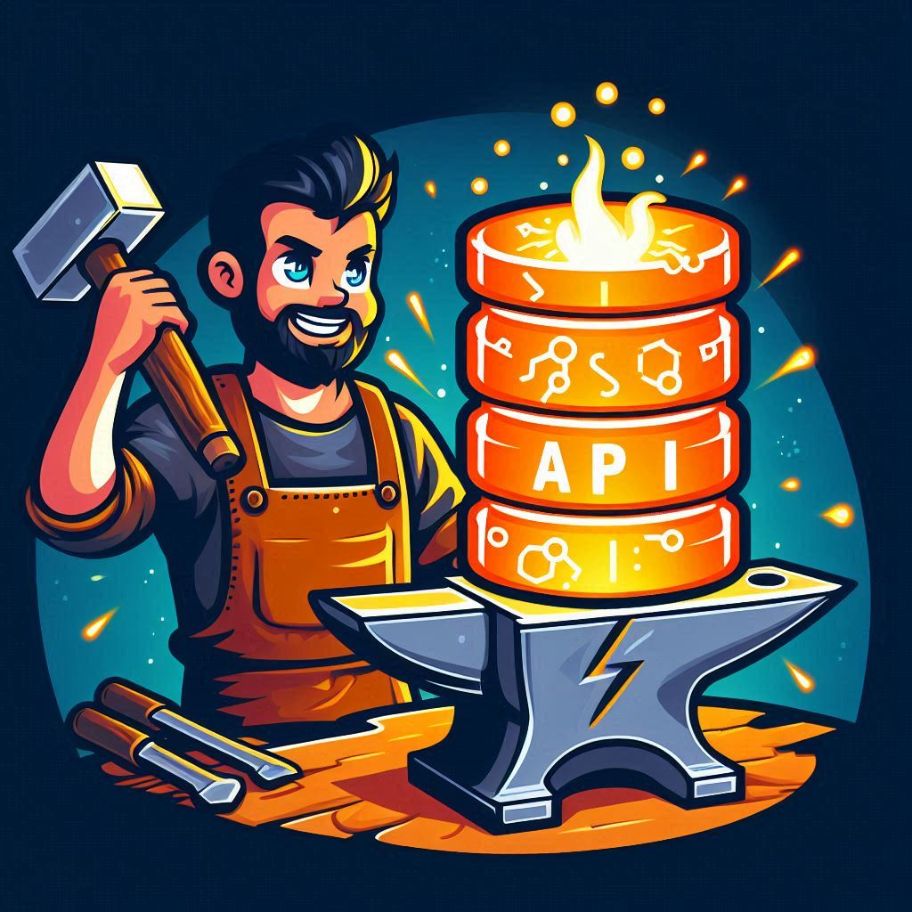

<p align="right">  </p>

# ForgeAPI - Database and REST-Endpoint generator

This Domain Specific Language (DSL) is designed to simplify the definition of databases and the automatic generation of REST endpoints for a Fastify Node.js server. It provides an intuitive way to define both the structure of a database and its associated endpoints.

- [1. General Structure](#1---general-structure)
- [2. Keywords](#2---keywords)
- [3. Definition of a Database Structure](#3---definition-of-a-database-structure)
  - [3.1 Database Definition (`DATABASE`)](#31---database-definition-database)
  - [3.2 Table Definition (`TABLE`)](#32---table-definition-table)
  - [3.3 Data Types](#33---data-types)
  - [3.4 Schema Definition Example](#34---schema-definition-example)
- [4. Definition of REST Endpoints](#4---definition-of-rest-endpoints)
  - [4.1 REST Endpoints (`REST`)](#41---rest-endpoints-rest)
  - [4.2 REST Endpoint Definition Example](#42---rest-endpoint-definition-example)
- [5. Comments](#5---comments)

## 1. - General Structure

The DSL uses declarative syntax to specify the structure of a database as well as the corresponding REST endpoints. The main components of the language are:
- **DATABASE**: Defines a database.
- **TABLE**: Defines tables within the database.
- **COLUMN**: Defines the columns of a table, along with their data types and optional constraints.
- **REST**: Defines REST endpoints for the tables.

## 2. - Keywords
There are a set of reserved keywords that cannot be used as identifiers (e.g., database or table names):

- `DATABASE`
- `TABLE`
- `COLUMN`
- `auto_id`
- `string`
- `integer`
- `float`
- `boolean`
- `date`
- `timestamp`
- `PK`
- `FK`
- `REST`
- `get`, `post`, `put`, `delete` (HTTP verbs)
- `not`
- `null`
- `Consensus_Node_Log`

## 3. - Definition of a Database Structure

The main part of the DSL is the definition of a structure for a relational database. This defined schema is then compiled to a SQL script to generate a master-slave replicated database system using MariaDB.

Info: When defining tables inside a database be aware that the order in which the tables are defined are important when using foreign keys. Same like in SQL.

### 3.1 - Database Definition (`DATABASE`)
```dsl
DATABASE dbname {
    TABLE table1 { ... }
    TABLE table2 { ... }
    REST { ... }
}
```

- `dbname`: The name of the database.
- `TABLE`: One or more tables within the database.
- `REST` (optional): A block defining the REST endpoints for the tables.

### 3.2 - Table Definition (`TABLE`)

```dsl
TABLE tablename {
    COLUMN colname datatype (PK)? (not null)?
    COLUMN colname datatype
    FK (tablename.colname)
}
```

- `tablename`: The name of the table.
- `COLUMN`: Defines a column within the table.
- `datatype`: The data type of the column, such as string(255), integer, float, boolean, date, timestamp.
- `PK`: An optional attribute indicating the column is a primary key.
- `not null`: An optional attribute indicating that the column cannot be NULL.
- `FK`: Defines a foreign key that references another table and column.

### 3.3 - Data Types

The DSL supports various data types for columns:
- `auto_id`: Equivalent to an auto-incrementing primary key (e.g., SERIAL in SQL).
- `string(x)`: Equivalent to VARCHAR(x) where x is the maximum length.
- `integer`: An integer value.
- `float`: A floating-point number.
- `boolean`: A true/false value.
- `date`: A date without time.
- `timestamp`: A date with time.

### 3.4 - Schema Defintion Example

```dsl
DATABASE mycompany {
    TABLE departments {
        COLUMN dept_id auto_id PK not null,
        COLUMN dept_name string(255) not null
    }
    
    TABLE employees {
        COLUMN emp_id auto_id PK not null,
        COLUMN first_name string(100) not null,
        COLUMN last_name string(100) not null,
        COLUMN dept_id integer not null,
        COLUMN birth_date date,
        COLUMN salary float,
        COLUMN hire_date timestamp not null,
        FK (departments.dept_id)
    }
}
```

## 4. - Definition of REST Endpoints

### 4.1 - REST Endpoints (`REST`)

```dsl
REST {
    tablename {
        get /url_path?params
        post /url_path?params
        put /url_path?params
        delete /url_path?params
    }
    tablename {...}
}
```

- `get`, `post`, `put`, `delete`: HTTP verbs for defining endpoints.
- `/url_path`: The path of the REST endpoint.
- `params` (optional): Parameters that can be passed to the endpoint. Can be concatinated by `&`

### 4.2 - REST Enpoint Definition Example

```dsl
REST {
    employees {
        get /getAllEmployees
        get /getEmployeesByName?first_name&last_name
        post /postEmployees?emp_id&first_name&last_name&dept_id&birth_date&salary&hire_date
        put /putEmployees?emp_id
        delete /deleteEmployee?emp_id
    }

    departments {
        get /getDepartments
        post /postDepartments?dept_id&dept_name
        delete /deleteDepartments?dept_name
    }
}
```

## 5. - Comments

Comments can be added in the DSL using a `%` symbol. Everything after the `%` on the same line is ignored.

Examle:
```dsl
% This is a comment
COLUMN dept_name string(255) not null % Department name
```


